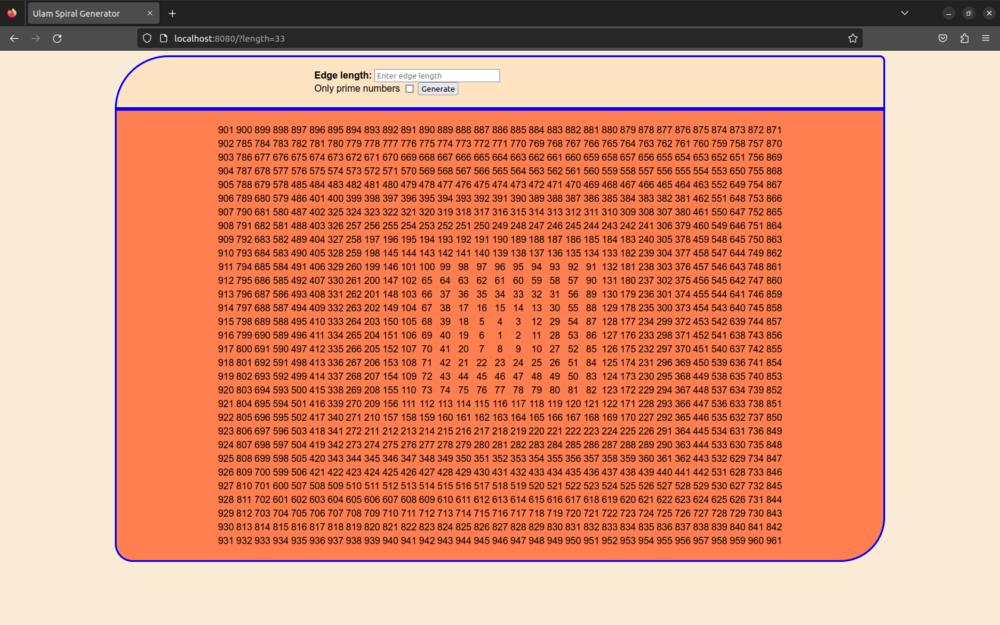
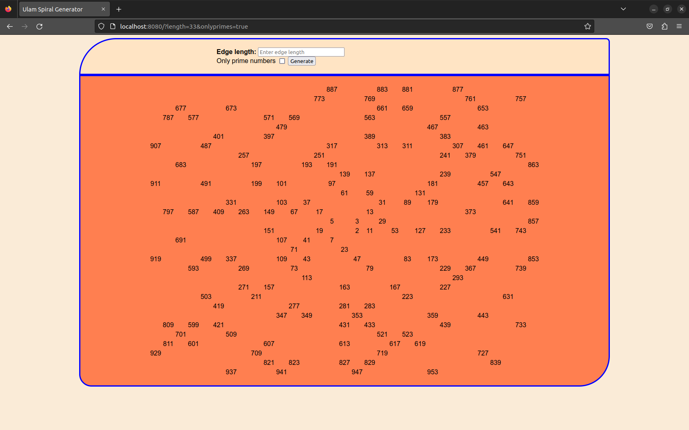

# Ulam Spiral in Spring Boot

## What was the purpose of writing this program
I tried to create working simple web app with using Thymeleaf

## What it can do and what do you need
Nothing complicated here. Enter edge size(odd number between 3 and 31), choose prime numbers or not and generate

_All numbers_ \

_Only prime numbers_ \

